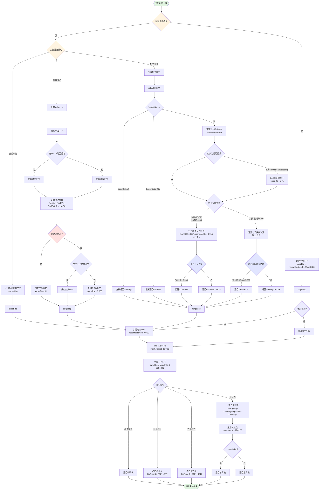

# 游戏调控系统思维导图

## 核心算法流程图

```mermaid
flowchart TD
    Start([用户发起旋转请求]) --> CheckMode{识别游戏模式}
    
    CheckMode -->|ItemID≠0| CardMode[卡片模式]
    CheckMode -->|MallBet≠0| BuyMode[购买特色模式]
    CheckMode -->|Extra≠0| ExtraMode[额外投注模式]
    CheckMode -->|其他| NormalMode[普通模式]
    
    CardMode --> CalcCost1[计算卡片成本]
    BuyMode --> CalcCost2[计算购买成本]
    ExtraMode --> CalcCost3[计算额外投注成本]
    NormalMode --> CalcCost4[计算普通成本]
    
    CalcCost1 --> BuildRequest[构建调整请求]
    CalcCost2 --> BuildRequest
    CalcCost3 --> BuildRequest
    CalcCost4 --> BuildRequest
    
    BuildRequest --> GetUserInfo[获取用户信息]
    GetUserInfo --> GetMerchantInfo[获取商户信息]
    GetMerchantInfo --> GetPool[获取资金池信息]
    GetPool --> GetConfig[获取调控配置]
    
    GetConfig --> CheckAdjustType{判断调控模式}
    
    CheckAdjustType -->|AdjustNormalFix| NaturalRTP[自然不控<br/>使用原始RTP]
    CheckAdjustType -->|AdjustNormalMerchantDynamic| PoolRTP[基本水池<br/>根据水池状态调整]
    CheckAdjustType -->|AdjustNormalNewbie| NewbieRTP[新手扶持<br/>周期性高RTP]
    
    PoolRTP --> CheckPool{水池是否充足}
    CheckPool -->|充足| UseUserRTP[使用用户RTP]
    CheckPool -->|不足| ReduceRTP[降低RTP 20%]
    
    NewbieRTP --> CheckBetCount{检查投注次数}
    CheckBetCount -->|扶持期内| HighRTP[返回100% RTP]
    CheckBetCount -->|非扶持期| NormalRTP[返回常规RTP]
    
    NaturalRTP --> Interpolation[内插法选择RTP表]
    UseUserRTP --> Interpolation
    ReduceRTP --> Interpolation
    HighRTP --> Interpolation
    NormalRTP --> Interpolation
    
    Interpolation --> DeductMission[扣除任务RTP 2%]
    DeductMission --> GetRTPType[确定RTP类型<br/>HIGH/MIDDLE/LOW]
    
    GetRTPType --> CheckWeightType{判断权重模式}
    
    CheckWeightType -->|WeightNone| OriginWeight[原生权重开奖]
    CheckWeightType -->|WeightSd1/2/3| SdWeight[标准差校正]
    CheckWeightType -->|WeightStreamer| StreamWeight[直播算法]
    CheckWeightType -->|WeightFeature| FeatureWeight[特色算法]
    
    SdWeight --> LimitMaxOdds[限制最大倍数]
    LimitMaxOdds --> AdjustSD[调整标准差]
    AdjustSD --> DeductVariance[消减高倍数方差]
    DeductVariance --> RedistributeRTP[重新分配RTP]
    
    StreamWeight --> ClassifyOdds[分类倍数]
    ClassifyOdds --> ForceFeature[强制特色权重]
    
    FeatureWeight --> CalcTargetIndex[计算目标表演索引<br/>循环选择]
    
    OriginWeight --> RandomSelect[权重随机选择]
    RedistributeRTP --> RandomSelect
    ForceFeature --> RandomSelect
    CalcTargetIndex --> DirectSelect[直接选择]
    
    RandomSelect --> GetOddsIndex[获得倍数索引]
    DirectSelect --> GetOddsIndex
    GetOddsIndex --> GetPerformanceIndex[获得表演索引]
    
    GetPerformanceIndex --> SelectTable{选择结果表}
    SelectTable -->|NormalBet| NormalTable[BoardResultNormal]
    SelectTable -->|CardBet| CardTable[BoardResultCard]
    SelectTable -->|BuyFeatureBet| BuyTable[BoardResultBuy]
    SelectTable -->|ExtraBet| ExtraTable[BoardResultExtra]
    
    NormalTable --> QueryES[从ES查询模板]
    CardTable --> QueryES
    BuyTable --> QueryES
    ExtraTable --> QueryES
    
    QueryES --> CalcScaleFactor[计算缩放因子<br/>actualBet/templateBet]
    CalcScaleFactor --> ScaleBet[缩放投注金额]
    ScaleBet --> ScalePaths[缩放所有金额路径]
    ScalePaths --> ValidateOdds{验证倍数是否保持}
    
    ValidateOdds -->|是| GenerateBetslip[生成注单]
    ValidateOdds -->|否| Error[错误处理]
    
    GenerateBetslip --> UpdatePool[更新资金池]
    UpdatePool --> UpdateUserControl[更新用户调控记录]
    UpdateUserControl --> ReturnResult([返回游戏结果])
    
    Error --> ReturnError([返回错误])
    
    style Start fill:#e1f5e1
    style ReturnResult fill:#e1f5e1
    style ReturnError fill:#ffe1e1
    style CheckMode fill:#fff4e1
    style CheckAdjustType fill:#fff4e1
    style CheckWeightType fill:#fff4e1
    style SelectTable fill:#fff4e1
    style RandomSelect fill:#e1e5ff
    style QueryES fill:#f0e1ff
```



## RTP计算详细流程



## 权重计算详细流程

```mermaid
flowchart TD
    Start([开始权重计算]) --> GetWeightID{获取权重模式ID}
    
    GetWeightID -->|WeightNone=1| None[原生权重]
    GetWeightID -->|WeightSd1=2| Sd1[标准差1<br/>maxSd=1.0]
    GetWeightID -->|WeightSd2=3| Sd2[标准差2<br/>maxSd=2.0]
    GetWeightID -->|WeightSd3=4| Sd3[标准差3<br/>maxSd=3.0]
    GetWeightID -->|WeightStreamer=5| Stream[直播算法]
    GetWeightID -->|WeightFeature=6| Feature[特色算法]
    
    None --> GetWeightList1["获取权重表<br/>rtpType2WeightOddsListMap(rtpType)"]
    None --> GetPerfList1[获取表演列表<br/>weightPerformanceList]
    GetWeightList1 --> OriginCalc[原始权重计算]
    GetPerfList1 --> OriginCalc
    
    Sd1 --> SdCommon[标准差校正流程]
    Sd2 --> SdCommon
    Sd3 --> SdCommon
    
    SdCommon --> GetWeightList2[获取权重表]
    SdCommon --> GetPerfList2[获取表演列表]
    GetWeightList2 --> CheckBetAmount{检查投注金额}
    GetPerfList2 --> CheckBetAmount
    
    CheckBetAmount -->|>450台币| LimitOdds[限制最大倍数≤50]
    CheckBetAmount -->|≤450台币| SkipLimit[跳过限制]
    
    LimitOdds --> CalcStats1[计算统计量<br/>avgOdds, maxOdds, variance, stdDev]
    SkipLimit --> CalcStats1
    
    CalcStats1 --> CheckMaxOdds{maxOdds>50?}
    CheckMaxOdds -->|是| DeductMaxOdds[消减超过50倍的权重]
    CheckMaxOdds -->|否| CheckVariance{variance>maxSd²?}
    
    DeductMaxOdds --> CalcCandidates1[计算候选倍数<br/>avgOdds到50倍之间]
    CalcCandidates1 --> Redistribute1[重新分配RTP给候选倍数]
    Redistribute1 --> CheckVariance
    
    CheckVariance -->|是| DeductVariance[消减方差<br/>从高倍数开始消减]
    CheckVariance -->|否| OriginCalc
    
    DeductVariance --> CalcCandidates2[计算候选倍数<br/>avgOdds±maxSd范围内]
    CalcCandidates2 --> Redistribute2[重新分配RTP]
    Redistribute2 --> OriginCalc
    
    Stream --> GetWeightList3[获取权重表]
    Stream --> GetPerfList3[获取表演列表]
    GetWeightList3 --> CheckForce{是否强制特色?}
    GetPerfList3 --> CheckForce
    
    CheckForce -->|是| GetFeatureOdds[获取特色倍数阈值]
    CheckForce -->|否| OriginCalc
    
    GetFeatureOdds --> ClassifyOdds[分类倍数<br/>零倍/非特色/特色]
    ClassifyOdds --> AdjustWeights[调整权重分配]
    AdjustWeights --> SetZeroWeight[零倍：固定权重100]
    SetZeroWeight --> SetNonFeature[非特色：均分400权重]
    SetNonFeature --> SetFeature[特色：均分500权重]
    SetFeature --> OriginCalc
    
    Feature --> GetFeatureList[获取特色列表<br/>featureList]
    GetFeatureList --> CalcTargetFeature[计算目标特色索引<br/>CurrentBetCount % len]
    CalcTargetFeature --> FindPerformance[查找对应的表演索引]
    FindPerformance --> DirectReturn[直接返回结果]
    
    OriginCalc --> CalcTotalWeight[计算总权重<br/>totalWeight = Σweights]
    CalcTotalWeight --> GenRandomValue[生成随机值<br/>randomValue 0 totalWeight]
    GenRandomValue --> IterateWeights[遍历权重列表]
    
    IterateWeights --> CompareWeight{randomValue < weight}
    CompareWeight -->|是| SelectOddsIndex[选中倍数索引 i]
    CompareWeight -->|否| DeductWeight[randomValue -= weight i<br/>i++]
    DeductWeight --> IterateWeights
    
    SelectOddsIndex --> GetPerfWeights[获取该倍数的表演权重列表]
    GetPerfWeights --> GenRandomValue2[生成随机值<br/>randomValue2]
    GenRandomValue2 --> IteratePerf[遍历表演权重列表]
    
    IteratePerf --> ComparePerf{randomValue2 < perfWeight j?}
    ComparePerf -->|是| SelectPerfIndex[选中表演索引 j]
    ComparePerf -->|否| DeductPerf[randomValue2 -= perfWeight j<br/>j++]
    DeductPerf --> IteratePerf
    
    SelectPerfIndex --> BuildResult[构建结果<br/>WeightResult]
    DirectReturn --> BuildResult
    
    BuildResult --> SetOdds[设置倍数<br/>weightOddsList-oddsIndex.Odds]
    SetOdds --> SetPerfIndex[设置表演索引<br/>performanceList-oddsIndex-perfIndex.PerformanceIndex]
    SetPerfIndex --> ReturnResult([返回权重结果])
    
    style Start fill:#e1f5e1
    style ReturnResult fill:#e1f5e1
    style GetWeightID fill:#fff4e1
    style CheckBetAmount fill:#fff4e1
    style CheckForce fill:#fff4e1
    style OriginCalc fill:#e1e5ff
    style BuildResult fill:#e1e5ff
```



## 文件组织结构

```
调控系统核心文件
├── spin.go (主入口)
│   ├── DoSpin() - 游戏旋转主函数
│   ├── getTemplateBoardResultAndScale() - 获取并缩放结果
│   └── scaleTargetBoardResult() - 缩放算法
│
├── gamemodecalculator.go (模式计算)
│   ├── CalculateGameModeCategoryAndGameBetMode() - 识别游戏模式
│   ├── calculateGameModeCategory() - 计算模式类别
│   ├── calculateGameBetMode() - 计算投注模式
│   └── CalculateSpinCost() - 计算投注成本
│
├── adjustmodule.go (调整模块)
│   ├── CalculateAdjustRequest() - 构建调整请求
│   ├── StartAdjust() - 开始调整处理
│   ├── CalculateRtpType() - 计算RTP类型
│   └── CalculateWeightResult() - 计算权重结果
│
├── adjustrtp/ (RTP计算)
│   ├── adjust_flow.go - RTP计算流程控制
│   │   ├── ChoseRtpTypeWithCard() - 卡片模式RTP
│   │   ├── ChoseRtpTypeRandom() - 自然不控RTP
│   │   └── ChoseRtpTypeWithAdjustTypeAndMission() - 调控模式RTP
│   ├── adjust_normal_fix.go - 自然不控算法
│   ├── adjust_normal_merchant_dynamic.go - 基本水池算法
│   ├── adjust_normal_newbie.go - 新手扶持算法
│   ├── interpolation.go - 内插法选择RTP表
│   └── mission.go - 任务RTP计算
│
├── weightrtp/ (权重计算)
│   ├── weight_flow.go - 权重计算流程控制
│   ├── weight_none.go - 原生权重算法
│   ├── weight_sd1.go - 标准差1算法
│   ├── weight_sd2.go - 标准差2算法
│   ├── weight_sd3.go - 标准差3算法
│   ├── weight_maxodds_adjustsd.go - 最大倍数限制+标准差
│   ├── weight_max_odds.go - 最大倍数限制算法
│   ├── weight_adjust_sd.go - 标准差调整算法
│   ├── weight_stream.go - 直播算法
│   ├── weight_feature.go - 特色算法
│   └── weight_card.go - 卡片模式权重
│
├── adjustcommon/ (通用工具)
│   ├── util.go - 工具函数
│   │   ├── CalculateOddsWeightArray() - 计算权重数组
│   │   ├── CalculateTotalWeight() - 计算总权重
│   │   ├── CalculateWeightIndex() - 权重随机选择
│   │   ├── CalculateStatistic() - 统计量计算
│   │   └── CalculatePerformanceResultOrigin() - 原始权重开奖
│   └── card.go - 卡片相关
│       └── CalculateCardRtp() - 计算卡片RTP
│
├── entity/ (数据结构)
│   ├── adjust.go - 调整相关实体
│   │   ├── AdjustRequest - 调整请求
│   │   ├── AdjustResult - 调整结果
│   │   ├── BaseRequest - 基础请求
│   │   ├── UserAdjust - 用户调整
│   │   ├── MerchantAdjust - 商户调整
│   │   ├── WeightResult - 权重结果
│   │   └── WeightStatistic - 权重统计
│   └── adjust_config.go - 调整配置
│       ├── AdjustConfig - 调整配置
│       ├── RtpCtrConfig - RTP控制配置
│       ├── PerformanceCtrConfig - 表演控制配置
│       ├── WeightOddsPair - 权重倍数对
│       └── PerformanceWeightPair - 表演权重对
│
├── serverconst/ (常量定义)
│   ├── game.go - 游戏相关常量
│   │   ├── GameModeCategory - 游戏模式类别
│   │   │   ├── Normal (普通)
│   │   │   ├── Card (卡片)
│   │   │   ├── BuyFeature (购买特色)
│   │   │   └── Extra (额外投注)
│   │   └── GameBetMode - 投注模式
│   │       ├── NormalBet (普通投注)
│   │       ├── CardBet (卡片投注)
│   │       ├── BuyFeatureBet01/02 (购买特色)
│   │       └── ExtraBet01/02 (额外投注)
│   └── game_adjust.go - 调控相关常量
│       ├── AdjustID - 调控模式
│       │   ├── AdjustNormalFix (自然不控)
│       │   ├── AdjustNormalMerchantDynamic (基本水池)
│       │   └── AdjustNormalNewbie (新手扶持)
│       └── WeightID - 权重模式
│           ├── WeightNone (原生权重)
│           ├── WeightSd1/2/3 (标准差校正)
│           ├── WeightStreamer (直播算法)
│           └── WeightFeature (特色算法)
│
└── reqdataservice/ (数据服务)
    └── spin.go
        └── GetGameResult() - 从ES获取游戏结果模板
```

## 关键指标与参数

### RTP相关
- **游戏基础RTP**: 通常 0.94 ~ 0.98 (94% ~ 98%)
- **任务RTP扣除**: 0.02 (2%)
  - 每日任务: 0.01 (1%)
  - VIP任务: 0.01 (1%)
- **水池不足扣减**: 0.2 (20%)
- **新手扶持RTP**: 1.0 (100%)
- **非扶持期扣减**: 0.015 (1.5%)

### 权重相关
- **标准差限制**:
  - WeightSd1: maxSd = 1.0 (最严格)
  - WeightSd2: maxSd = 2.0 (中等)
  - WeightSd3: maxSd = 3.0 (最宽松)
- **最大倍数限制**:
  - 投注阈值: 450 台币
  - 最大倍数: 50 倍
- **直播算法权重分配**:
  - 零倍权重: 100
  - 非特色权重: 400
  - 特色权重: 500

### 新手扶持相关
- **循环周期**: 300 次
- **小额投注阈值**: 15 台币
- **个人池扣减**: 0.05 (5%)
- **极端RTP上限**: 1.0 (100%)
- **极端RTP下限**: 0.065 (6.5%)

### 缩放相关
- **基础投注额**: 1.0
- **金额精度**: 保留2位小数
- **存储节省**: 99% (100MB → 1MB)

## 配置示例数值

### rtpType2RtpMap (RTP表映射)
```
DYNAMIC_RTP_LOW: 0.94 (94%)
DYNAMIC_RTP_MIDDLE: 0.96 (96%)
DYNAMIC_RTP_HIGH: 0.98 (98%)
```

### weightOddsListMap 示例 (权重倍数列表)
```
倍数  权重   概率
0    100   10%
1    200   20%
5    300   30%
10   200   20%
50   150   15%
100  50    5%
```

### 统计量示例
```
平均倍数 (E[X]): 18.7
最大倍数 (MaxOdds): 100
方差 (Variance): 927.81
标准差 (StdDev): 30.46
```

---