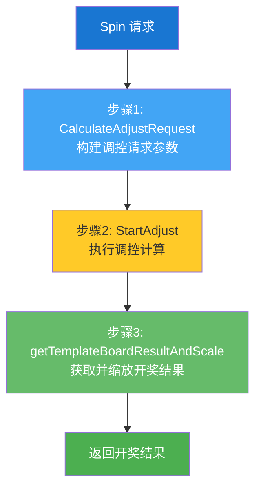
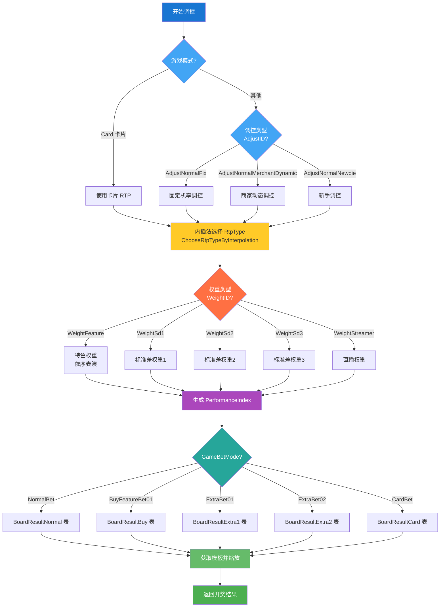
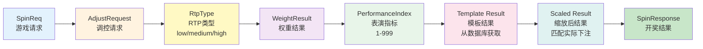

# 调控和结果计算流程

## 执行流程



---

## 完整流程图

```mermaid
graph TB
    A[HandleSpin 开始] --> B[解析请求参数]
    B --> C[获取用户/商家信息]
    C --> D[验证请求合法性]
    D --> E[计算下注成本]
    
    E --> F[CalculateAdjustRequest<br/>构建调控请求]
    F --> F1[获取用户调控资料]
    F1 --> F2[构建基础请求参数<br/>BaseRequest]
    F2 --> F3[设置商家调控信息<br/>MerchantAdjust]
    F3 --> F4[设置用户调控信息<br/>UserAdjust]
    F4 --> F5[获取调控配置<br/>AdjustConfig]
    
    F5 --> G[StartAdjust<br/>执行调控]
    G --> G1[CalculateRtpType<br/>计算 RTP 类型]
    
    G1 --> G2{游戏模式?}
    G2 -->|卡片模式| G3[卡片 RTP 计算]
    G2 -->|随机模式| G4[固定机率计算]
    G2 -->|调控模式| G5[任务调控计算]
    
    G3 --> G6[内插法选择<br/>RtpType]
    G4 --> G6
    G5 --> G51[扣除任务 RTP]
    G51 --> G6
    
    G6 --> G7[CalculateWeightResult<br/>计算权重结果]
    G7 --> G8{WeightID?}
    G8 -->|Feature| G9[特色权重<br/>依序表演]
    G8 -->|其他| G10[标准权重<br/>随机选择]
    
    G9 --> G11[生成 PerformanceIndex<br/>和 Odds]
    G10 --> G11
    
    G11 --> H[getTemplateBoardResultAndScale<br/>获取开奖模板]
    H --> H1{GameBetMode?}
    H1 --> H2[选择对应数据表<br/>Normal/Buy/Extra/Card]
    H2 --> H3[根据 PerformanceIndex<br/>查询模板结果]
    H3 --> H4[scaleTargetBoardResult<br/>缩放结果]
    
    H4 --> H5[计算缩放因子<br/>spinCost / templateBet]
    H5 --> H6[应用缩放到所有金额路径]
    H6 --> H7[返回缩放后的开奖 JSON]
    
    H7 --> I[生成注单索引]
    I --> J[计算金额信息<br/>bet/win/netWin]
    J --> K[准备交易数据]
    K --> L[执行交易]
    L --> M[构建返回结果]
    M --> N[返回给客户端]
    
    style A fill:#1565c0,color:#fff
    style F fill:#42a5f5,color:#fff
    style G fill:#ffa726
    style G6 fill:#fff59d
    style G7 fill:#ff7043,color:#fff
    style H fill:#66bb6a,color:#fff
    style H4 fill:#26a69a,color:#fff
    style N fill:#2e7d32,color:#fff
```



---

## 关键决策点



---

## 数据流转



---

## 核心算法说明

### 1 内插法（Interpolation）

用于在两个 RTP 类型之间进行概率选择：

```
计算公式：
p = (targetRtp - lowerRtp) / (higherRtp - lowerRtp)

示例：
targetRtp = 0.94
lowerRtp = 0.90 (medium)
higherRtp = 0.96 (high)

p = (0.94 - 0.90) / (0.96 - 0.90) = 0.67

结果：
- 33% 概率选择 medium
- 67% 概率选择 high
```

### 2 特色权重依序表演

```
targetIndex = CurrentBetCount % len(featureList)
performanceIndex = featureList[targetIndex]

示例：
featureList = [10, 50, 100, 200]
CurrentBetCount = 7
→ targetIndex = 3
→ performanceIndex = 200
```

### 3 缩放因子

```
scaleFactor = spinCost / templateBet

示例：
templateBet = 1.0
spinCost = 5.0
→ scaleFactor = 5.0
→ 所有金额字段 × 5.0
```

---

## 关键方法速查

| 阶段 | 核心方法 | 功能 |
|------|---------|------|
| **1. 请求构建** | `CalculateAdjustRequest` | 收集所有调控相关参数 |
| **2. RTP 计算** | `CalculateRtpType` | 根据模式计算 RTP 类型 |
| | `ChoseRtpTypeWithCard` | 卡片模式计算 |
| | `ChoseRtpTypeRandom` | 随机模式计算 |
| | `ChoseRtpTypeWithAdjustTypeAndMission` | 任务调控计算 |
| | `ChooseRtpTypeByInterpolation` | 内插法选择类型 |
| **3. 权重计算** | `CalculateWeightResult` | 根据权重类型路由 |
| | `CalculateWeightFeatureResult` | 特色权重计算 |
| | `calculateWeightResult` | 核心权重逻辑 |
| **4. 结果生成** | `getTemplateBoardResultAndScale` | 获取并缩放模板 |
| | `scaleTargetBoardResult` | 执行缩放操作 |

---
