# 调控和结果计算流程思维导图

## 整体流程概览

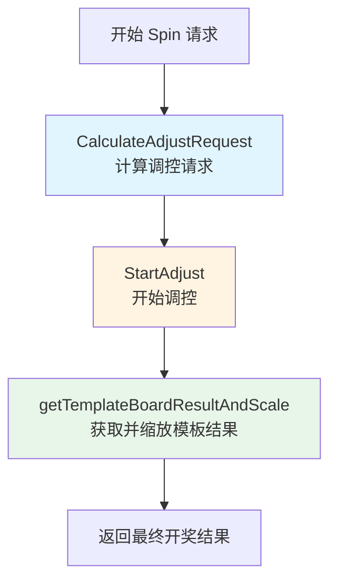

---

## 一、CalculateAdjustRequest - 计算调控请求

### 1.1 主流程
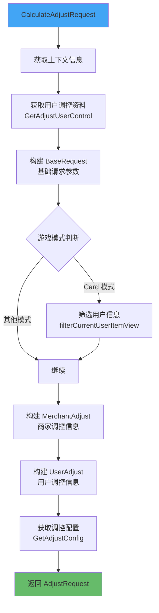

### 1.2 关键数据结构
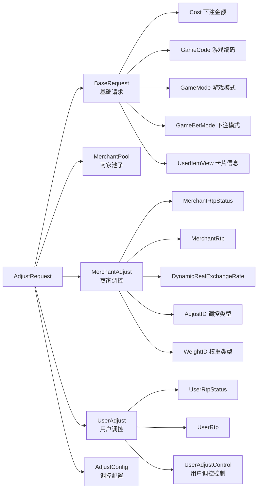

---

## 二、StartAdjust - 开始调控处理

### 2.1 主流程
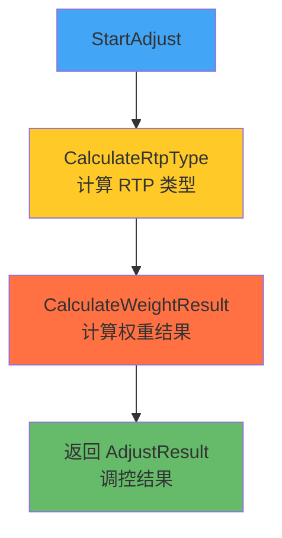

### 2.2 CalculateRtpType - 计算 RTP 类型

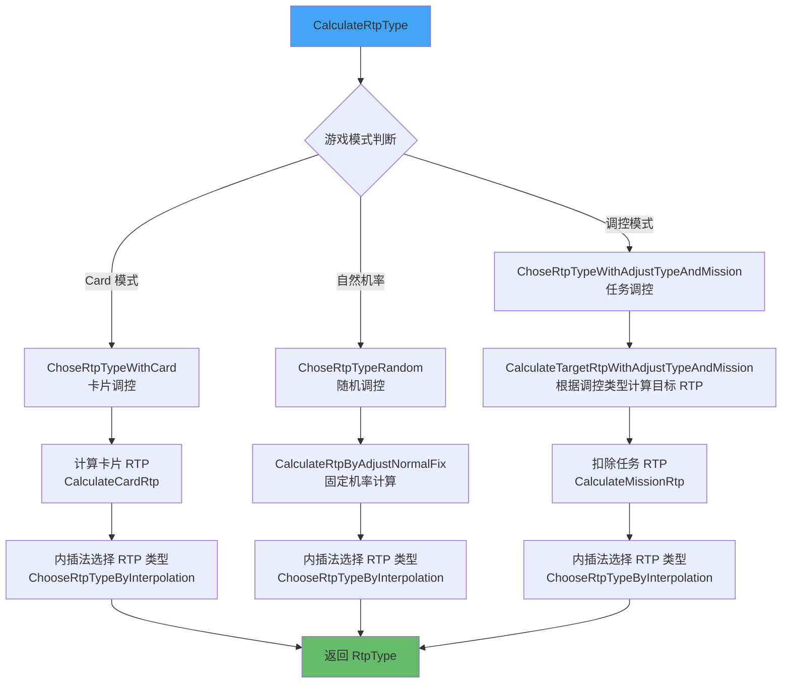

### 2.3 CalculateTargetRtpWithAdjustTypeAndMission - 根据调控类型计算

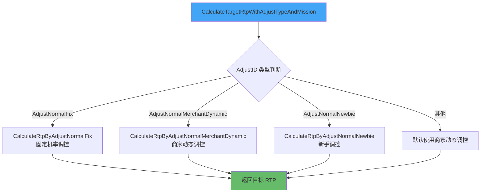

### 2.4 ChooseRtpTypeByInterpolation - 内插法选择 RTP 类型

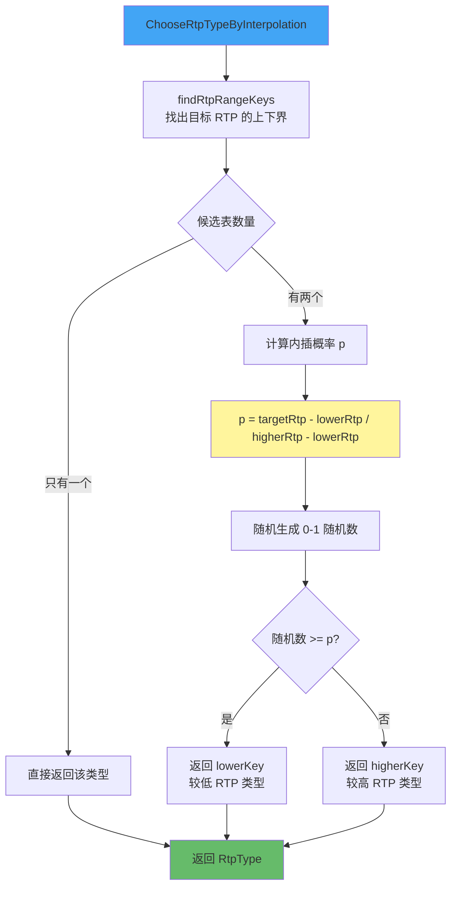

### 2.5 CalculateWeightResult - 计算权重结果

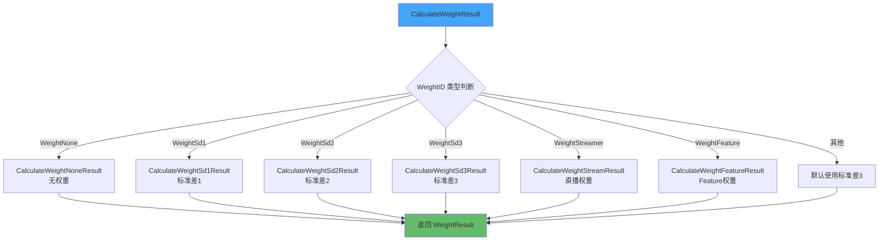

### 2.6 CalculateWeightFeatureResult - Feature权重计算（详细）

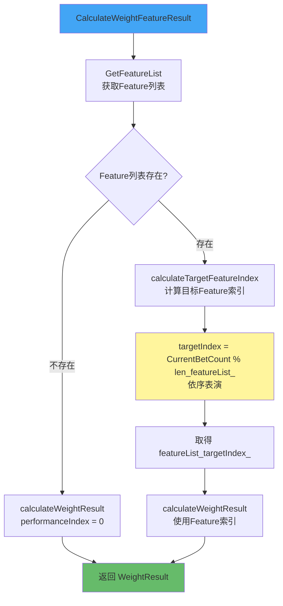

### 2.7 calculateWeightResult - 核心权重计算

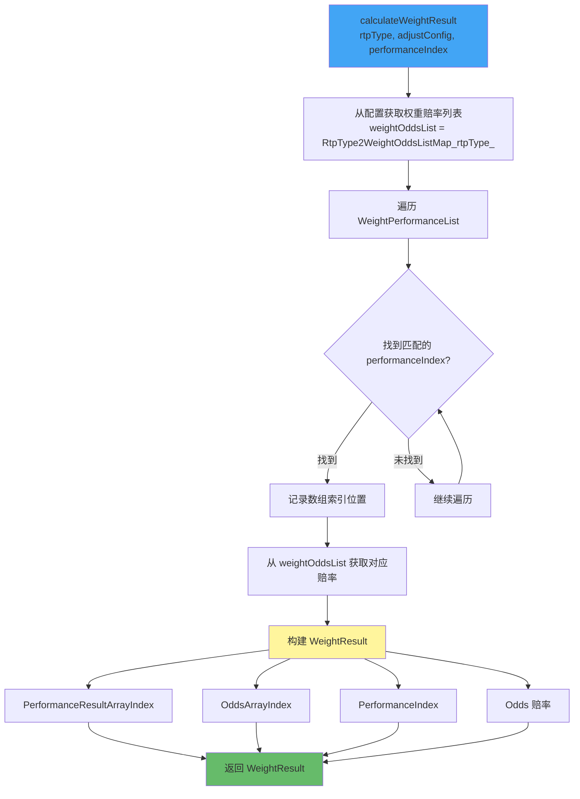

---

## 三、getTemplateBoardResultAndScale - 获取并缩放模板结果

### 3.1 主流程
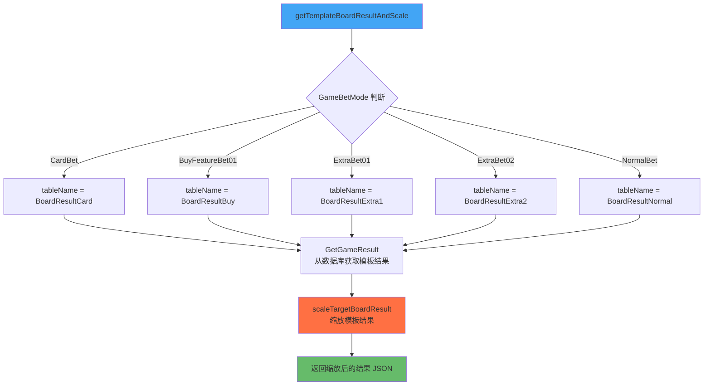

### 3.2 scaleTargetBoardResult - 缩放模板结果

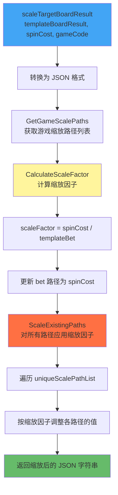

---

## 四、完整流程整合

### 4.1 从 Spin 请求到开奖结果
```mermaid
graph TB
    Start[HandleSpin 处理游戏请求] --> Step1[解析 SpinReq 请求]
    Step1 --> Step2[验证请求合法性]
    Step2 --> Step3[计算下注成本 spinCost]
    Step3 --> Step4[CalculateAdjustRequest<br/>构建调控请求参数]
    
    Step4 --> Step5[StartAdjust<br/>执行调控逻辑]
    
    Step5 --> Sub5A[CalculateRtpType<br/>计算 RTP 类型]
    Sub5A --> Sub5B{游戏模式}
    Sub5B -->|卡片| Sub5C[卡片 RTP 计算]
    Sub5B -->|随机| Sub5D[固定机率计算]
    Sub5B -->|调控| Sub5E[任务调控计算]
    
    Sub5C --> Sub5F[内插法选择 RtpType]
    Sub5D --> Sub5F
    Sub5E --> Sub5G[扣除任务 RTP]
    Sub5G --> Sub5F
    
    Sub5F --> Sub5H[CalculateWeightResult<br/>计算权重结果]
    Sub5H --> Sub5I{WeightID 类型}
    Sub5I -->|Feature| Sub5J[Feature权重计算]
    Sub5I -->|其他| Sub5K[标准权重计算]
    
    Sub5J --> Sub5L[calculateWeightResult<br/>生成 PerformanceIndex 和 Odds]
    Sub5K --> Sub5L
    
    Sub5L --> Step6[返回 AdjustResult<br/>包含 WeightResult]
    
    Step6 --> Step7[getTemplateBoardResultAndScale<br/>获取开奖模板]
    
    Step7 --> Sub7A{GameBetMode}
    Sub7A --> Sub7B[选择对应表格]
    Sub7B --> Sub7C[GetGameResult<br/>根据 PerformanceIndex 查询]
    Sub7C --> Sub7D[scaleTargetBoardResult<br/>缩放结果]
    
    Sub7D --> Sub7E[计算缩放因子]
    Sub7E --> Sub7F[应用到所有路径]
    
    Sub7F --> Step8[返回缩放后的开奖结果 JSON]
    
    Step8 --> Step9[calculateRdx1AndRdx2<br/>生成注单索引]
    Step9 --> Step10[calculateBetAndWinAndNetWin<br/>计算金额]
    Step10 --> Step11[prepareTransaction<br/>准备写入数据库]
    Step11 --> Step12[doSpinTransaction<br/>执行写入数据库]
    Step12 --> Step13[calculateGaiaSpinResponse<br/>构建返回结果]
    Step13 --> End[返回给客户端]
    
    style Start fill:#1976d2
    style Step4 fill:#42a5f5
    style Step5 fill:#ffca28
    style Sub5F fill:#fff59d
    style Sub5H fill:#ff7043
    style Step7 fill:#66bb6a
    style Sub7D fill:#26a69a
    style End fill:#66bb6a
```

---

## 五、关键计算方法说明

### 5.1 核心方法列表

| 方法名 | 功能说明 | 输入 | 输出 |
|--------|----------|------|------|
| **CalculateAdjustRequest** | 构建调控请求参数 | SpinReq, 用户信息, 商家信息 | AdjustRequest |
| **StartAdjust** | 执行调控逻辑 | AdjustRequest | AdjustResult |
| **CalculateRtpType** | 计算 RTP 类型 | AdjustRequest | RtpType (string) |
| **ChoseRtpTypeWithCard** | 卡片模式 RTP 计算 | AdjustRequest | RtpType |
| **ChoseRtpTypeRandom** | 随机模式 RTP 计算 | AdjustRequest | RtpType |
| **ChoseRtpTypeWithAdjustTypeAndMission** | 任务调控 RTP 计算 | AdjustRequest | RtpType |
| **CalculateTargetRtpWithAdjustTypeAndMission** | 根据调控类型计算目标 RTP | AdjustRequest | targetRtp (float64) |
| **CalculateRtpByAdjustNormalFix** | 固定机率调控 | AdjustRequest | RTP |
| **CalculateRtpByAdjustNormalMerchantDynamic** | 商家动态调控 | AdjustRequest | RTP |
| **CalculateRtpByAdjustNormalNewbie** | 新手调控 | AdjustRequest | RTP |
| **CalculateMissionRtp** | 计算任务 RTP | - | missionRtp |
| **ChooseRtpTypeByInterpolation** | 内插法选择 RTP 类型 | rtpType2RtpMap, targetRtp | RtpType |
| **findRtpRangeKeys** | 找出目标 RTP 的上下界 | candidates, targetRtp | []rtpKeys |
| **CalculateWeightResult** | 计算权重结果（路由） | rtpType, AdjustRequest | WeightResult |
| **CalculateWeightFeatureResult** | Feature权重计算 | rtpType, AdjustRequest | WeightResult |
| **calculateTargetFeatureIndex** | 计算Feature索引（依序表演） | featureList, userAdjustControl | performanceIndex |
| **calculateWeightResult** | 核心权重计算 | rtpType, adjustConfig, performanceIndex | WeightResult |
| **getTemplateBoardResultAndScale** | 获取并缩放模板 | spinCost, gameBetMode, adjustResult | boardResultJson |
| **scaleTargetBoardResult** | 缩放模板结果 | templateBoardResult, spinCost, gameCode | boardResultJson |
| **CalculateScaleFactor** | 计算缩放因子 | templateBet, spinCost | scaleFactor |
| **ScaleExistingPaths** | 对路径应用缩放 | json, paths, scaleFactor | scaledJson |

### 5.2 数据流转示意

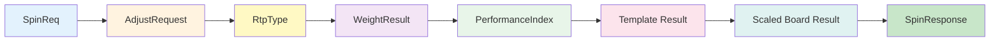

---

## 六、关键配置和数据结构

### 6.1 AdjustConfig 调控配置

```
AdjustConfig
├── RtpCtrConfig (RTP 控制配置)
│   └── RtpType2RtpMap (RTP类型 -> RTP值 映射)
│       ├── "low": 0.85
│       ├── "medium": 0.95
│       └── "high": 0.98
│
└── PerformanceCtrConfig (表演控制配置)
    ├── RtpType2WeightOddsListMap (RTP类型 -> 权重赔率列表)
    │   ├── "low": [...]
    │   ├── "medium": [...]
    │   └── "high": [...]
    │
    └── WeightPerformanceList (权重表演列表)
        └── [[{PerformanceIndex: 1, Weight: 100}, ...], ...]
```

### 6.2 WeightResult 权重结果

```
WeightResult
├── PerformanceIndex (表演指标)
├── PerformanceResultArrayIndex (表演结果数组索引)
├── OddsArrayIndex (赔率数组索引)
└── Odds (赔率值)
```

### 6.3 AdjustResult 调控结果

```
AdjustResult
├── GameCode (游戏编码)
└── WeightResult (权重结果)
```

---

## 七、特殊逻辑说明

### 7.1 内插法（Interpolation）选择 RTP 类型

内插法用于在两个 RTP 类型之间进行概率选择，确保实际 RTP 更接近目标值。

**计算公式：**
```
p = (targetRtp - lowerRtp) / (higherRtp - lowerRtp)
```

**选择逻辑：**
- 生成随机数 `r ∈ [0, 1)`
- 如果 `r >= p`：选择 `lowerKey`（较低 RTP 类型）
- 如果 `r < p`：选择 `higherKey`（较高 RTP 类型）

**示例：**
```
假设：
- lowerRtp = 0.90 (RTP类型: "medium")
- higherRtp = 0.96 (RTP类型: "high")
- targetRtp = 0.94

计算：
- p = (0.94 - 0.90) / (0.96 - 0.90) = 0.04 / 0.06 ≈ 0.67

结果：
- 有 33% 概率选择 "medium"
- 有 67% 概率选择 "high"
- 期望 RTP ≈ 0.90 × 0.33 + 0.96 × 0.67 ≈ 0.94
```

### 7.2 Feature权重依序表演

对于 `WeightFeature` 类型，系统会依序展示特定的表演效果：

```
targetIndex = CurrentBetCount % len(featureList)
performanceIndex = featureList[targetIndex]
```

**示例：**
```
featureList = [10, 50, 100, 200]
CurrentBetCount = 7

计算：
- targetIndex = 7 % 4 = 3
- performanceIndex = featureList[3] = 200
```

### 7.3 缩放因子计算

确保模板结果与实际下注金额匹配：

```
scaleFactor = spinCost / templateBet

示例：
- templateBet = 1.0
- spinCost = 5.0
- scaleFactor = 5.0

结果：
- 所有金额相关字段（bet, win, totalWin 等）都会乘以 5.0
```

---

## 八、流程总结

### 8.1 三大阶段

1. **调控请求构建阶段**（CalculateAdjustRequest）
   - 收集用户、商家、游戏相关信息
   - 构建完整的调控请求参数

2. **调控计算阶段**（StartAdjust）
   - 根据调控类型计算目标 RTP
   - 使用内插法选择 RTP 类型
   - 根据权重类型计算表演指标

3. **结果生成阶段**（getTemplateBoardResultAndScale）
   - 根据表演指标获取模板结果
   - 根据实际下注金额缩放结果
   - 生成最终开奖结果

### 8.2 关键决策点

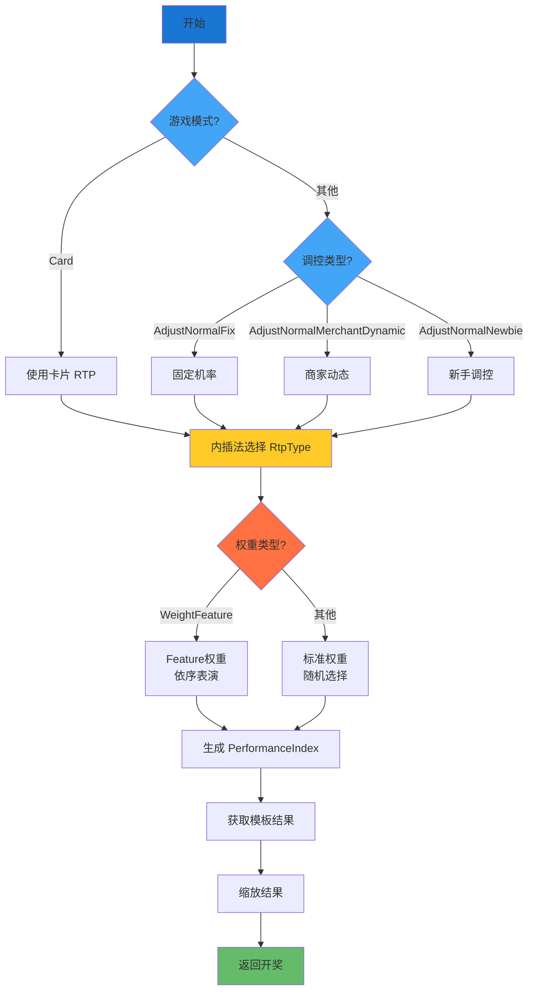

---

## 九、代码位置索引

| 功能模块 | 文件路径 |
|---------|---------|
| 主流程处理 | `spinservice/spin.go` |
| 调控模块 | `spinservice/adjustmodule.go` |
| RTP 类型计算 | `spinservice/adjustrtp/adjust_flow.go` |
| 内插法实现 | `spinservice/adjustrtp/interpolation.go` |
| 固定机率调控 | `spinservice/adjustrtp/adjust_normal_fix.go` |
| 商家动态调控 | `spinservice/adjustrtp/adjust_normal_merchant_dynamic.go` |
| 新手调控 | `spinservice/adjustrtp/adjust_normal_newbie.go` |
| 任务 RTP | `spinservice/adjustrtp/mission.go` |
| 权重计算路由 | `spinservice/weightrtp/weight_flow.go` |
| Feature权重 | `spinservice/weightrtp/weight_feature.go` |
| 卡片权重 | `spinservice/weightrtp/weight_card.go` |

---